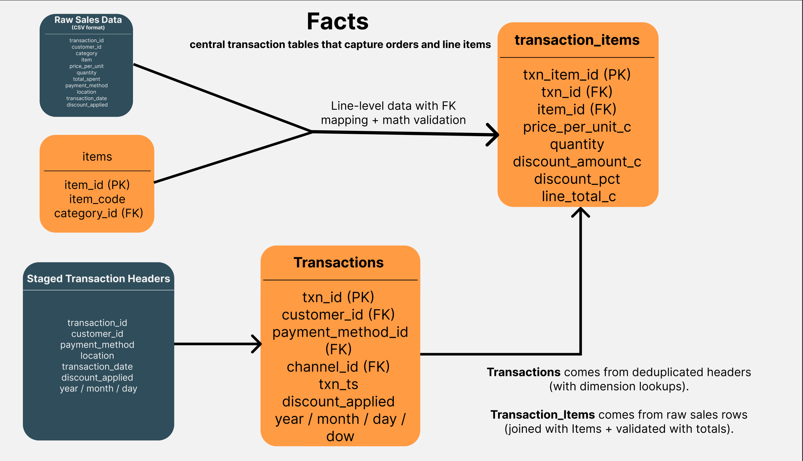
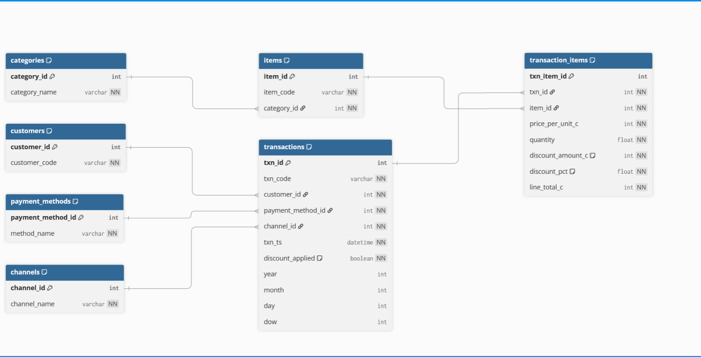
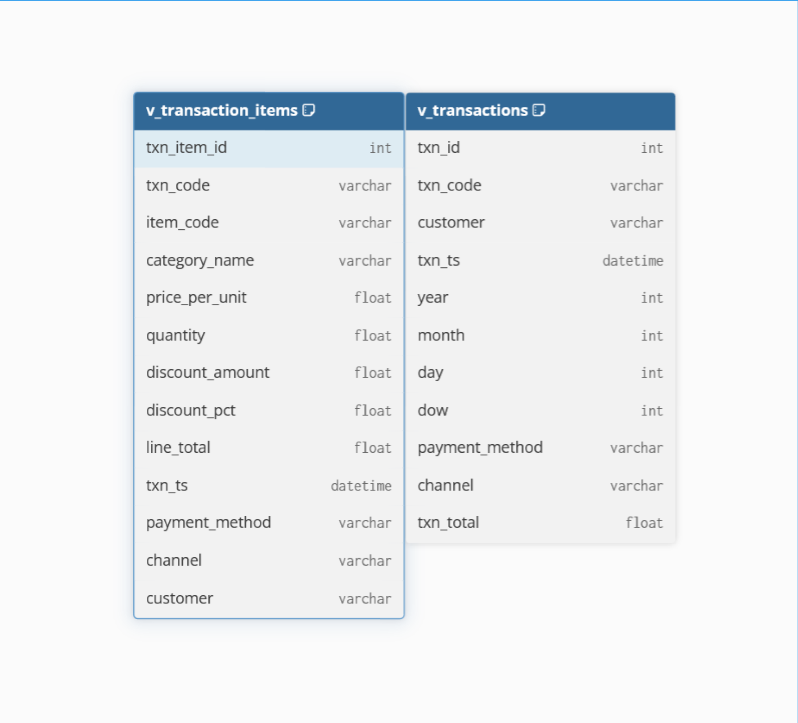

This project showcases a complete data pipeline, starting with messy retail transaction data and transforming it into a clean, validated, and analysis-ready relational database. It highlights skills in data cleaning (Python/pandas), schema design (SQLite), and clear communication of data lineage through professional diagrams. The result is a reproducible workflow that ensures accuracy and creates business-ready reporting tables and views.

# Sales Data Cleaning and Database Project

This project demonstrates an end-to-end ETL pipeline: cleaning retail transaction data, enforcing consistency checks, and structuring it into a relational database for analysis.

---

## Data Cleaning and Transformation

The dataset underwent systematic cleaning to ensure accuracy and consistency:

- **Dates:** Removed invalid dates, flagged out-of-range values, and extracted `Year/Month/Day`.  
- **Numerics:** Checked for negative values, validated `Total Spent ≈ Price × Quantity`, and intelligently backfilled missing values.  
- **Discounts:** Standardized discount fields, inferred missing discounts, repaired mismatches, and ensured consistency between math and flags.  
- **Categoricals:** Normalized categories, payment methods, and locations to a controlled vocabulary.  
- **Duplicates:** Removed exact duplicates and flagged duplicate transaction IDs.  

Final outputs include:  
- **Analysis-ready dataset** (clean rows with no hard errors).  
- **QA dataset** (rows flagged for anomalies or incomplete data).  

---

## Database Schema

Cleaned data is loaded into a SQLite database structured as a star schema.

### Staging
- `stg_sales_raw`: canonicalized input rows.  
- `stg_txn_header`: deduplicated headers with calendar fields.  

### Dimensions
- `customers(customer_id, customer_code)`  
- `categories(category_id, category_name)`  
- `items(item_id, item_code, category_id)`  
- `payment_methods(payment_method_id, method_name)`  
- `channels(channel_id, channel_name)`  

### Facts
- `transactions`: header-level data (txn_id, customer_id, payment_method_id, channel_id, txn_ts, etc.).  
- `transaction_items`: line-level details (txn_item_id, txn_id, item_id, quantity, price_per_unit_c, discounts, line_total_c).  

### Views
- `v_transactions`: one row per transaction with computed totals.  
- `v_transaction_items`: denormalized detail rows with customer, product, category, and dollarized amounts.  

---

## Visuals

The pipeline is documented through diagrams:

1. **Staging → Dimensions**  
   Raw rows cleaned into reusable lookup tables.  
   

2. **Facts**  
   Central transaction tables capture orders and items.  
   

3. **Entity Relationship Diagram (ERD)**  
   Complete schema with relationships across tables.  
   

4. **Analytics Views**  
   Reporting layers ready for BI tools.  
   

---

## Key Outcomes
- Ensures data integrity through validation, flagging, and automated repairs.  
- Schema design follows best practices with staging, dimensions, facts, and reporting views.  
- Final outputs are analysis-ready and aligned with business reporting needs.  

---

## Technology
- Python (pandas, numpy) for data cleaning.  
- SQLite for database creation.  
- Figma and dbdiagram.io for schema visualization.  